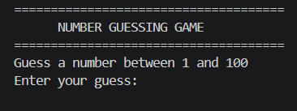
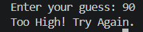
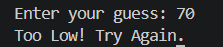
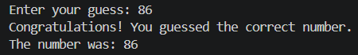

# Number Guessing Game — C++

A console-based number guessing game built in C++. The program picks a random number between 1 and 100, and you keep guessing until you get it right — with hints after every wrong attempt to point you in the right direction.

Built as a hands-on project to strengthen core C++ programming skills by developing an interactive application with random number generation and user input handling.

---

## How it works

The game generates a random number at the start of each session. You enter a guess, and the program tells you whether to go higher or lower. Once you hit the correct number, it shows how many attempts it took and gives you a performance rating based on that.

The project focuses on building a simple, interactive game while practicing fundamental C++ programming concepts in a practical way.

---

## What it does

- Generates a random number between 1 and 100
- Gives higher/lower hints after each wrong guess
- Tracks the number of attempts throughout the game
- Rates your performance once you guess correctly
- Runs entirely in the terminal with a clean interface

---

## Getting started

You'll need a C++ compiler (GCC works fine) and that's about it.

**Clone the repo:**
```bash
git clone https://github.com/manavc1303-cell/INIB-Number-Guessing-Game.git
cd INIB-Number-Guessing-Game
```

**Compile:**
```bash
g++ main.cpp -o main
```

**Run:**
```bash
./main
```

On Windows, the output binary will be `main.exe` — run it the same way.

---

## Project structure

```
INIB-Number-Guessing-Game/
├── main.cpp          # All the logic lives here
├── README.md
├── .gitignore
└── screenshots/
```

Everything is kept in a single file intentionally — easier to read and follow for a project at this scale.

---

## Concepts this project covers

- Variables and data types
- Loops and conditional statements
- Random number generation using `rand()` and `srand()`
- User input and output handling
- Basic function usage from the standard library

Nothing overcomplicated — the goal was to write something clean and working while getting comfortable with how C++ handles randomness and user interaction.

---

## Screenshots

A quick look at the game in action.

**Game Start**


**Too High**


**Too Low**


**Correct Guess**


**Final Score**


---

## Built with

- C++
- Visual Studio Code
- GCC compiler
- Git & GitHub

---

## About

Developed by **Manav**, a B.Tech CSE student.

This project was created as a learning exercise to strengthen core C++ programming skills through practical implementation.

If this helped you or you're working on something similar, feel free to star the repo or open an issue.
